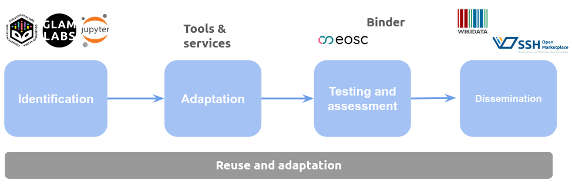

# Introduction

This research analyses how existing Jupyter Notebooks can be adapted for other datasets and purposes following a systematic and multilayered approach. This work was presented at the [Web Archiving Conference (WAC) IIPC](https://www.ghentcdh.ugent.be/2026-web-archiving-conference-wac-iipc) in  2026.  

## Methodology

It provides a framework that works in several steps as described in the following picture.

## Results

We employed the material created for the workshop iPRESS conference including a collection of Jupyter Notebooks reusing Web Archive content and employing AI-based methods such as Retrieval-Augmented Generation. The original material is available in this [link](https://github.com/NLNZDigitalPreservation/wa-nlnz-toolkit/tree/main/notebook/iPRES2025).

We reused the code provided in order to apply it to the GLAM sector, in particular, the digital collection [A Medical History of British India](https://data.nls.uk/data/digitised-collections/a-medical-history-of-british-india/) made available by the National Library of Scotland.

## Licence
 Content is licensed under a <a rel="license" href="http://creativecommons.org/licenses/by/4.0/">Creative Commons Attribution 4.0 International license</a>.

Please, note that the datasets used in this project have separate licences.

## Acknowledgments
We would to thank the [International GLAM Labs Community](https://www.glamlabs.io/) for their support and help to create this work.

## References
- Candela, G., Chambers, S., & Sherratt, T. (2023). An approach to assess the quality of Jupyter projects published by GLAM institutions. Journal of the Association for Information Science and Technology, 74(13), 1550–1564. https://doi.org/10.1002/asi.24835
- Candela, Gustavo, Milena Dobreva, Henk Alkemade, Olga Holownia, Mahendra Mahey, Sarah Ames, Karen Renaud, Ines Vodopivec, Benjamin Charles Germain Lee, Thomas Padilla, Steven Claeyssens, Isto Huvila and Beth Knazook. “A Use Case Lens on Digital Cultural Heritage.” ArXiv abs/2509.08710 (2025): n. pag.
- National Library of Scotland. A Medical History of British India. National Library of Scotland, 2019. https://doi.org/10.34812/2w0t-3f08
